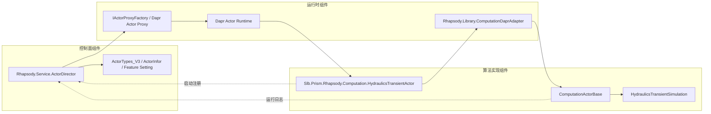
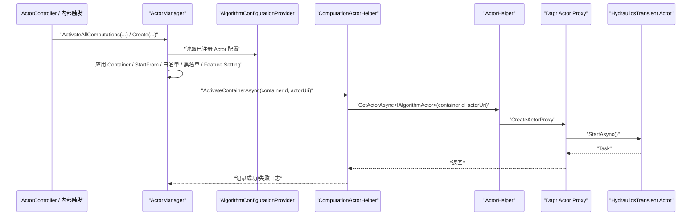
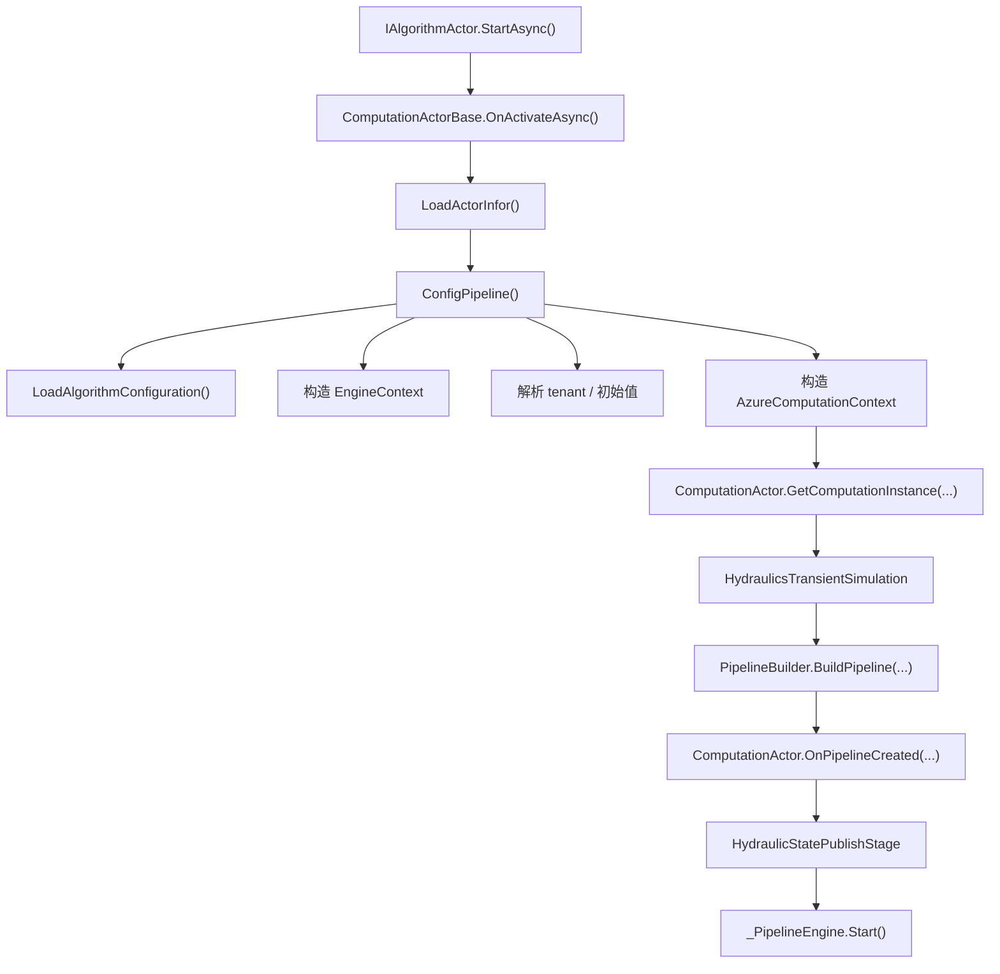

# 从 Actor Director 到算法 Actor 的调用链

## 1. 背景与阅读指南

本文面向熟悉 C#、但不一定熟悉 Prism 新架构的开发者，目标是帮助读者从一条真实链路理解下面 5 个问题：

- 入口在哪里
- Actor 如何被发现并启动
- 算法如何接入
- 日志怎么看
- 问题怎么排查

本文以以下三个仓库内实现为主样例：

- `Actors/Rhapsody.Service.ActorDirector`
- `Actors/Rhapsody.Computation.HydraulicsTransient`
- `Shared/Rhapsody.Library.ComputationDaprAdapter`

建议按下面顺序阅读源码：

1. `Actors/Rhapsody.Service.ActorDirector/Slb.Prism.Rhapsody.Service.ActorDirector/Controllers/ActorController.cs`
2. `Actors/Rhapsody.Service.ActorDirector/Slb.Prism.Rhapsody.Service.ActorDirector/ActorManager.cs`
3. `Actors/Rhapsody.Service.ActorDirector/Slb.Prism.Rhapsody.Service.ActorDirector/Helper/ComputationActorHelper.cs`
4. `Actors/Rhapsody.Service.ActorDirector/Slb.Prism.Rhapsody.Service.ActorDirector/Helper/ActorHelper.cs`
5. `Actors/Rhapsody.Computation.HydraulicsTransient/Slb.Prism.Rhapsody.Computation.HydraulicsTransientActor/Program.cs`
6. `Actors/Rhapsody.Computation.HydraulicsTransient/Slb.Prism.Rhapsody.Computation.HydraulicsTransientActor/ComputationActor.cs`
7. `Shared/Rhapsody.Library.ComputationDaprAdapter/ComputationDaprAdapter/Extensions/WebApplicationBuilderExtensions.cs`
8. `Shared/Rhapsody.Library.ComputationDaprAdapter/ComputationDaprAdapter/ComputationActorBase.cs`

在旧架构里，算法 Actor 运行在 Service Fabric Actor/Worker 模式上；在新架构里，Actor 模式保留，但运行时切换为 Dapr Actor，后台宿主切换为 ASP.NET Core。对调用链来说，最重要的变化是：

- `ActorDirector` 不再直接依赖 Service Fabric Actor Runtime，而是通过 `IActorProxyFactory.CreateActorProxy` 调用算法 Actor。
- 算法 Actor 不再靠 Service Fabric 启动入口注册自己，而是在 `BuildApplication<TActor>()` 阶段通过 `IActorDirectorService.Register(...)` 反向注册到 `ActorDirector`。
- 计算运行时被抽到 `ComputationActorBase` 和 `Rhapsody.Library.ComputationDaprAdapter` 中，具体算法 Actor 只保留少量定制点。

## 2. 总体架构图



图例：

- 控制面组件：负责注册信息、激活决策、对外 API、上下文与配置查询
- 运行时组件：负责 Actor 宿主、代理调用、通用计算运行时
- 算法实现组件：负责算法 Actor 包装、算法实例、输出阶段

## 3. 三条关键链路

### 3.1 注册链路

注册链路发生在算法 Actor 服务启动时，而不是第一次业务调用时。

1. `HydraulicsTransient` 服务从 `Program.cs` 进入，执行 `builder.BuildApplication<ComputationActor>()`。
2. `Rhapsody.Library.ComputationDaprAdapter.Extensions.WebApplicationBuilderExtensions.BuildApplication<TActor>()` 完成 Dapr Actor 宿主、配置、外部服务、日志等初始化。
3. 该方法内部调用 `InitializeRegistration(containerType)`。
4. `InitializeRegistration(...)` 读取 `ComputationManifestProvider.AlgorithmConfiguration` 和程序集版本，生成注册信息：
   - `Name`
   - `Version`
   - `ActorUri = $"{config.Name}-{version.Major}"`
   - `Container`
   - `StartFrom`
   - 输入 Channels / TimeSeries / CriticalChannels
5. `RegisterActor(...)` 通过 `IActorDirectorService.Register(actor)` 把算法注册到 `ActorDirector`。
6. `ActorDirectorService.Register(...)` 最终调用 `ActorDirector` 的 `actortype` 接口。
7. `ActorDirector` 侧通过 `ActorTypeAccessor` 落到 Mongo 集合 `ActorTypes_V3`，供后续激活与查询使用。

这条链路的关键点是：算法 Actor 启动后会反向注册自己，所以 `ActorDirector` 激活算法 Actor 之前，必须先有可用的注册信息。

### 3.2 激活链路

激活链路是本文的主线，核心路径如下：

`ActorDirector API/内部调度 -> ActorManager -> ComputationActorHelper -> ActorHelper -> IActorProxyFactory.CreateActorProxy -> IAlgorithmActor.StartAsync`



实际入口有两类：

- 对外 API 入口：`ActorController.Create(...)`、`ActorController.Reset(...)`、`ActorController.ResendContext(...)`
- 内部调度入口：`ActorManager.ActivateAllComputations(...)`

主流程中的关键职责如下：

- `ActorController`
  - 接收外部请求
  - 解析 `wellId`、`containerId`、算法名和版本
  - 在需要时触发 `StartStreamingAsync(...)`
- `ActorManager`
  - 读取已注册算法配置
  - 基于 `Container` 过滤 `well` / `wellbore`
  - 基于 `StartFrom`、白名单、黑名单、Feature Setting 决定某个算法是否应激活
  - 对每个目标算法调用 `ComputationActorHelper.ActivateContainerAsync(...)`
- `ComputationActorHelper`
  - 记录“开始启动 Actor”和“启动成功/失败”的日志
  - 通过 `IActorHelper` 获取 `IAlgorithmActor` 代理
  - 调用 `StartAsync()`
- `ActorHelper`
  - 不直接创建对象
  - 通过 `IActorProxyFactory.CreateActorProxy<T>(new ActorId(actorId), serviceUri)` 创建 Dapr Actor 代理

因此，`ActorDirector` 与算法 Actor 之间不是直接 `new` 出对象，而是通过 Dapr Actor Proxy 跨边界调用。

### 3.3 运行链路

运行链路发生在算法 Actor 被首次调用或被 `StartAsync()` 显式启动之后。

1. Dapr Actor Runtime 激活 `ComputationActor`。
2. `ComputationActor` 继承 `ComputationActorBase`，实际运行逻辑主要在基类。
3. `ComputationActorBase.OnActivateAsync()` 调用 `ConfigPipeline()`。
4. `ConfigPipeline()` 先通过 `_ServiceHub.ActorDirectorService.GetActorInfor(StringId)` 获取 `ActorInfor`。
5. 基类组装 `EngineContext`，包括：
   - `WellId`
   - `ContainerId`
   - `StateManager`
   - `Logger`
   - `AlgorithmConfiguration`
   - `OutputChannels`
   - `EngineConfiguration`
6. 基类通过 `ResourceDiscoveryService` 解析 tenant。
7. 基类调用 `SetInitialValues(...)` 设置部分初始输入。
8. 基类构造 `AzureComputationContext`。
9. `ComputationActor.GetComputationInstance(...)` 返回 `HydraulicsTransientSimulation` 实例。
10. 基类通过 `PipelineBuilder.BuildPipeline(...)` 创建 `ComputationPipeline`。
11. `ComputationActor.OnPipelineCreated(...)` 添加 `HydraulicStatePublishStage` 这一算法特有输出阶段。
12. `_PipelineEngine.Start()` 启动计算。



这里最重要的判断是：`ComputationActor` 只是算法 Actor 的薄包装层，真正把“Actor 调用”转换成“计算引擎启动”的是 `ComputationActorBase`。

## 4. 主调用链分步说明

下面按“谁调用谁、传什么、在哪个文件、产出什么状态/日志”的方式，把主链路拆开。

### Step 1: 入口进入 ActorDirector

常见入口：

- `ActorController.Create(ActorCreateModel createModel)`
- `ActorManager.ActivateAllComputations(string wellId, bool startStreaming = false)`
- `ActorController.ResendContext(...)`

传入的关键参数：

- `wellId`
- `containerId`
- `name`
- `version`
- `actorId`

产出：

- 选中的目标 `containerId`
- 待激活的算法清单
- 控制面日志，例如“谁触发了创建/重置/激活”

### Step 2: ActorDirector 读取可激活配置

关键类：

- `AlgorithmConfigurationProvider`
- `ActorTypeAccessor`

`AlgorithmConfigurationProvider` 会周期性从 `ActorTypeAccessor.Get()` 同步 Mongo 中的算法定义，并缓存到内存中。这里缓存的是“哪个算法可用、它的 `ActorUri` 是什么、属于哪种 `Container`、从什么时间开始支持”。

产出：

- `Actors`
- `StreamSamplingActor`
- `BatchSchedulerActor`

### Step 3: ActorManager 做激活决策

`ActorManager.ActivateAllComputations(...)` 会继续做几层过滤：

- `Container` 是否匹配 `well` 或 `wellbore`
- `StartFrom` 是否早于井创建时间
- 自定义数据里的 whitelist / blacklist
- Feature Setting 中 `ComputationNotRun` 的黑名单

产出：

- 真的需要激活的算法列表
- 跳过原因日志，例如：
  - 因黑名单跳过
  - 因井创建时间早于 `StartFrom` 跳过
  - 因缓存防抖跳过

### Step 4: ActorDirector 通过 Dapr Proxy 激活算法 Actor

`ComputationActorHelper.ActivateContainerAsync(containerId, actorUri)` 的关键动作是：

1. 记录开始日志
2. `actorHelper.GetActorAsync<IAlgorithmActor>(containerId, actorUri)`
3. `await actor.StartAsync()`
4. 记录成功或失败日志

`ActorHelper.GetActorAsync<T>(...)` 内部调用：

```csharp
proxyFactory.CreateActorProxy<T>(new ActorId(actorId), serviceUri)
```

这里的 `actorId` 通常就是 `containerId`，例如 `wellId` 或 `wellboreId`；`serviceUri` 则是注册时写入的 `ActorUri`，例如 `HydraulicsTransientActor-2` 这种“算法名 + 主版本号”的形式。

### Step 5: 算法 Actor 宿主启动

`HydraulicsTransient` 侧的入口非常薄：

- `Program.cs` 只做 `builder.BuildApplication<ComputationActor>()`

宿主初始化工作主要由 `BuildApplication<TActor>()` 完成：

- 配置日志
- 配置外部服务
- `BuildActorHost<TActor>()`
- `app.MapActorsHandlers()`
- 初始化配置代理
- 向 `ActorDirector` 注册当前算法

产出：

- 可被 Dapr 访问的 Actor 端点
- 已注册到 `ActorDirector` 的算法元数据

### Step 6: 基类启动计算引擎

`ComputationActorBase` 做了绝大部分通用工作：

- 查询 `ActorInfor`
- 计算日志前缀
- 读取算法配置
- 构造 `EngineContext`
- 解析 tenant
- 绑定状态管理器
- 创建 `AzureComputationContext`
- 组装 pipeline
- 启动 `_PipelineEngine`

产出：

- 处于运行中的计算 pipeline
- 带 `well`、`container`、`instanceId` 的结构化日志

### Step 7: 具体算法接管

`HydraulicsTransient` 的定制逻辑主要集中在 `ComputationActor.cs`：

- `GetComputationInstance(...)`
  - 返回 `new HydraulicsTransientSimulation(...)`
- `OnPipelineCreated(...)`
  - 添加 `HydraulicStatePublishStage`
- `GetHydraulicState()`
  - 对外暴露一个算法专属的查询方法

这说明一个算法 Actor 的职责通常只有两类：

- 告诉基类“真正的算法实例是什么”
- 告诉基类“额外的输出阶段或专属接口是什么”

## 5. StreamSampling 与算法 Actor 的关系

`StreamSampling` 不是本文主线，但它和算法 Actor 的激活顺序相关。

在 `ActorManager.StartStreamingAsync(...)` 和 `ActorController.Create(...)` 中，通常会先确保 `StreamSamplingActor` 被启动，再启动算法 Actor。原因是算法 Actor 的实时输入依赖采样流或上下文重发。

相关类：

- `SamplingActorHelper`
- `IStreamSamplingActor`

可以把它理解为：

- `StreamSamplingActor` 负责“喂数据”
- 算法 Actor 负责“做计算”

本文不展开 `StreamSampling` 内部实现，只把它视为算法 Actor 的上游依赖。

## 6. 关键定制点

如果要新增一个算法 Actor，最关键的定制点如下。

### 6.1 `Program.cs`

保持入口极薄，通常只需要：

```csharp
var builder = WebApplication.CreateBuilder(args);
var app = builder.BuildApplication<ComputationActor>();
app.Run();
```

这里最重要的是让宿主通过 `BuildApplication<TActor>()` 接入统一运行时。

### 6.2 `ComputationActor`

这是每个算法最核心的包装类，通常需要做三件事：

- 继承 `ComputationActorBase`
- 实现自己的 Actor 接口，例如 `IHydraulicsTransientActor`
- 覆盖必要的定制点

最常见的覆盖点：

- `GetComputationInstance(...)`
- `OnPipelineCreated(...)`

### 6.3 算法入口

`GetComputationInstance(...)` 负责把 Actor 与真实算法类连接起来。以 `HydraulicsTransient` 为例，返回的是 `HydraulicsTransientSimulation`。

如果不想手写实例化逻辑，基类默认也支持按配置中的 `EntryPoint` 反射加载算法 DLL 和类型；但像 `HydraulicsTransient` 这样直接 new 出实例，通常更直观。

### 6.4 输出阶段

如果算法需要额外输出、发布状态、转换结果，就在 `OnPipelineCreated(...)` 里往 pipeline 增加 stage。

`HydraulicsTransient` 的样例是：

- `HydraulicStatePublishStage`

### 6.5 `appsettings.json`

文档重点关注日志配置，尤其是：

- `LoggerSetup.EnricherConfiguration.Properties.ProviderName`

它需要和服务名对应。例如 `HydraulicsTransient` 使用：

- `Slb.Prism.Rhapsody.Service.HydraulicsTransientActor-2`

这个值会直接影响日志平台中的来源识别与检索体验。

### 6.6 容器类型与注册信息

新增算法时还需要确认：

- `Container` 是 `well` 还是 `wellbore`
- `ActorUri` 是否符合 `Name-MajorVersion`
- `StartFrom` 是否正确
- 输入 Channels / TimeSeries / CriticalChannels 是否完整

这些信息最终决定：

- `ActorDirector` 能否找到它
- `ActorManager` 会不会激活它
- `StreamSampling` 会不会为它订阅正确的数据

## 7. 配置与注册机制

### 7.1 `ActorUri`

`ActorUri` 不是随便写的字符串，而是由算法名和程序集主版本拼出来：

- `ActorUri = $"{config.Name}-{version.Major}"`

这意味着：

- 同一算法的大版本升级会产生新的 Actor URI
- `ActorDirector` 激活时必须用注册时保存的 `ActorUri`

### 7.2 `Container`

`Container` 决定算法挂在哪一层数据容器上：

- `well`
- `wellbore`

如果 Mongo 里未配置，`ActorTypeAccessor` 和 `AlgorithmConfigurationProvider` 都会把默认值补成 `well`。

### 7.3 `StartFrom`

`ActorManager.ShouldActivate(...)` 会比较井创建时间与 `StartFrom`。如果井创建时间早于算法支持时间，Actor 会被跳过，并留下说明日志。

### 7.4 黑白名单与 Feature Setting

Actor 是否激活还会受到以下因素影响：

- `CustomData` 中的 `whitelist`
- `CustomData` 中的 `blacklist`
- Feature Setting 中的 `ComputationNotRun`

因此，当一个算法“已经注册但没有启动”时，不能只看注册表，还要看这些控制项。

## 8. 日志与排障

推荐按“入口日志 -> 激活日志 -> Actor 激活日志 -> pipeline 配置日志”的顺序排查。

### 8.1 入口日志

先看 `ActorDirector`：

- `ActorController`
- `ActorManager`
- `ComputationActorHelper`

重点关键词：

- `creates actor`
- `Activated all computations`
- `Begin start actor`
- `Start actor succeed`
- `Start actor failed`

如果这里已经失败，问题一般在：

- 算法未注册
- `ActorUri` 不对
- `containerId` 不对
- 过滤条件导致未被选中

### 8.2 Actor 激活日志

再看算法 Actor 服务：

- `begin activate actor`
- `activate actor succeed`
- `activate actor failed`

这些日志主要来自 `ComputationActorBase.OnActivateAsync()`。

### 8.3 Pipeline 配置日志

如果 Actor 已被调起，但计算没跑起来，继续看：

- `Succeed to get actorinfor`
- `Succeed to config computation pipeline`
- `Failed to get tenant`
- `Cannot find module`
- `Cannot find type`

这些日志集中在 `ComputationActorBase.LoadActorInfor()` 和 `ConfigPipeline()`。

### 8.4 常见问题清单

#### 问题 1：算法未注册

现象：

- `ActorDirector` 找不到算法配置
- `ActorTypeAccessor.Get(name, version)` 结果为空

优先检查：

- 算法服务是否成功启动
- `BuildApplication<TActor>()` 是否执行了注册
- `ActorDirectorService.Register(...)` 是否成功

#### 问题 2：无法激活

现象：

- 有注册记录，但 `ActorManager` 没有真的调 `StartAsync()`

优先检查：

- `Container` 是否匹配
- `StartFrom` 是否导致被跳过
- whitelist / blacklist
- Feature Setting 黑名单

#### 问题 3：拿不到 `ActorInfor`

现象：

- Actor 端日志出现 `No actorinfor found`

优先检查：

- `ActorDirectorService.GetActorInfor(...)` 是否可访问
- `actorId` 是否正确
- `ActorInfor` 是否已提前写入

#### 问题 4：租户解析失败

现象：

- `Failed to get tenant for well ...`

优先检查：

- `ResourceDiscoveryService`
- `wellId` / `containerId` 是否传错

#### 问题 5：算法 DLL 或类型找不到

现象：

- `Cannot find module ...`
- `Cannot find type ...`

优先检查：

- 算法 DLL 是否被正确打包到服务目录
- `EntryPoint` 是否与实际类型名一致
- 版本或包内容是否正确

## 9. 推荐阅读代码路径

- `Actors/Rhapsody.Service.ActorDirector/Slb.Prism.Rhapsody.Service.ActorDirector/Controllers/ActorController.cs`
- `Actors/Rhapsody.Service.ActorDirector/Slb.Prism.Rhapsody.Service.ActorDirector/ActorManager.cs`
- `Actors/Rhapsody.Service.ActorDirector/Slb.Prism.Rhapsody.Service.ActorDirector/Helper/ComputationActorHelper.cs`
- `Actors/Rhapsody.Service.ActorDirector/Slb.Prism.Rhapsody.Service.ActorDirector/Helper/ActorHelper.cs`
- `Actors/Rhapsody.Service.ActorDirector/Slb.Prism.Rhapsody.Service.ActorDirector/Helper/AlgorithmConfigurationProvider.cs`
- `Actors/Rhapsody.Service.ActorDirector/Slb.Prism.Rhapsody.Service.ActorDirector/Database/ActorTypeAccessor.cs`
- `Actors/Rhapsody.Computation.HydraulicsTransient/Slb.Prism.Rhapsody.Computation.HydraulicsTransientActor/Program.cs`
- `Actors/Rhapsody.Computation.HydraulicsTransient/Slb.Prism.Rhapsody.Computation.HydraulicsTransientActor/ComputationActor.cs`
- `Actors/Rhapsody.Computation.HydraulicsTransient/Slb.Prism.Rhapsody.Computation.HydraulicsTransientActor/appsettings.json`
- `Shared/Rhapsody.Library.ComputationDaprAdapter/ComputationDaprAdapter/Extensions/WebApplicationBuilderExtensions.cs`
- `Shared/Rhapsody.Library.ComputationDaprAdapter/ComputationDaprAdapter/ComputationActorBase.cs`
- `Shared/Rhapsody.Library.ComputationDaprAdapter/ComputationDaprAdapter/RemoteServices/ActorDirectorService.cs`
- `Shared/Rhapsody.Library.ComputationDaprAdapter/ComputationDaprAdapter/RemoteServices/ServiceHub.cs`

## 10. 术语表

- `ActorDirector`
  - 控制面服务，负责注册、查询、激活辅助、上下文和状态相关 API
- `AlgorithmActor`
  - 运行具体算法的 Dapr Actor
- `ActorUri`
  - Actor 的逻辑服务名，通常是“算法名 + 主版本号”
- `ActorInfor`
  - Actor 实例运行所需的上下文信息，例如 `WellId`、`ContainerId`、运行模式等
- `Container`
  - 算法运行绑定的数据容器层级，常见为 `well` 或 `wellbore`
- `ComputationActorBase`
  - 统一封装 Actor 生命周期、配置、上下文、pipeline、状态与日志的通用基类
- `StreamSamplingActor`
  - 为算法提供实时输入流或订阅管理的上游 Actor

## 11. 小结

把整条链路压缩成一句话，就是：

`ActorDirector` 先根据注册信息和控制规则决定“该启动谁”，再通过 `IActorProxyFactory` 调用算法 Actor 的 `StartAsync()`；算法 Actor 宿主由 `BuildApplication<TActor>()` 建好，真正的计算启动由 `ComputationActorBase` 完成，具体算法只需要在 `ComputationActor` 中接上自己的计算实例和输出阶段。

理解这句话后，新增一个算法 Actor、定位一次启动失败、或者解释新架构相对旧 Service Fabric 方案的变化，都会容易很多。
